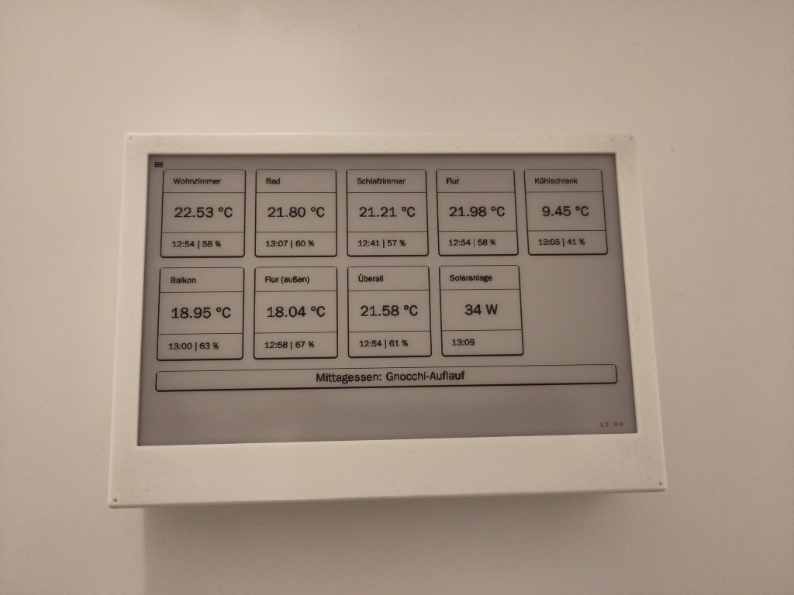
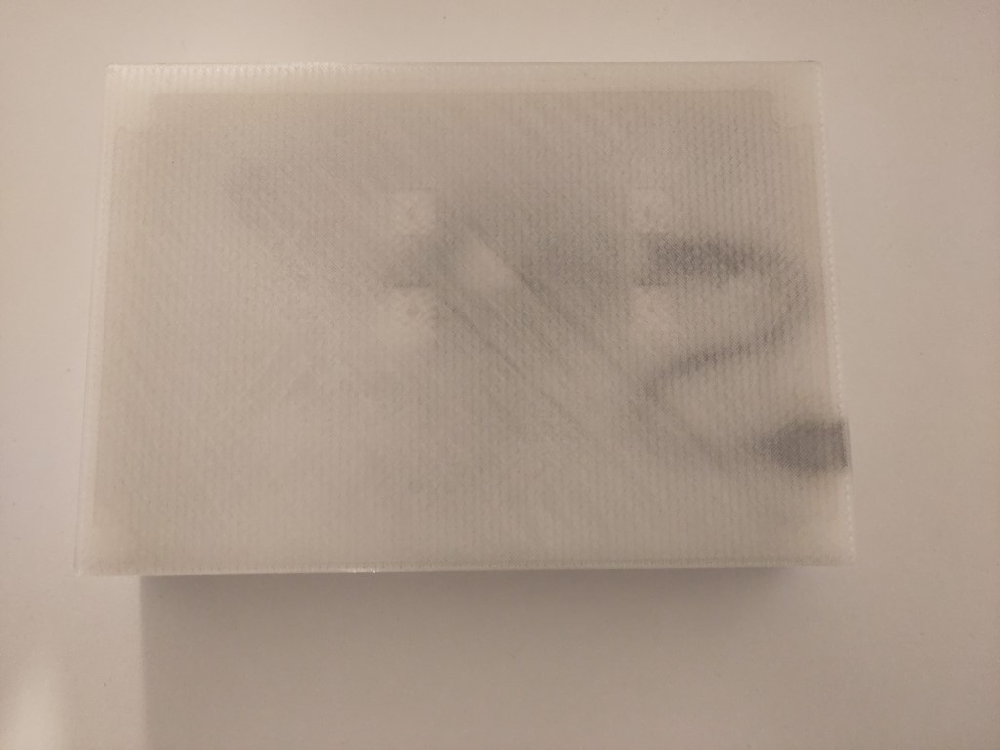
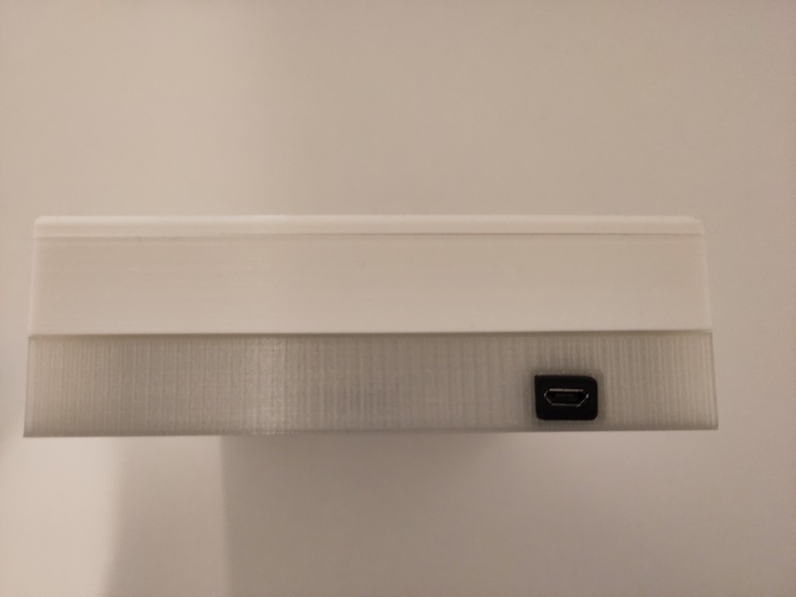

# ScreenshotCreator


  
[](https://sonarcloud.io/summary/new_code?id=mu88_ScreenshotCreator)
[](https://sonarcloud.io/summary/new_code?id=mu88_ScreenshotCreator)
[](https://sonarcloud.io/summary/new_code?id=mu88_ScreenshotCreator)
[](https://sonarcloud.io/summary/new_code?id=mu88_ScreenshotCreator)
[](https://sonarcloud.io/summary/new_code?id=mu88_ScreenshotCreator)
[](https://sonarcloud.io/summary/new_code?id=mu88_ScreenshotCreator)
[](https://sonarcloud.io/summary/new_code?id=mu88_ScreenshotCreator)
[](https://dashboard.stryker-mutator.io/reports/github.com/mu88/ScreenshotCreator/main)

## Goal
ScreenshotCreator is a versatile and easy-to-use tool that allows you to capture screenshots programmatically. It provides a simple API for taking screenshots of web pages, which can be used for displaying them on a Waveshare ePaper display attached to a Raspberry Pi Pico W.

Scroll down to the bottom for some pictures.

## Features
- Capture full-page screenshots of web pages
- Specify custom viewport dimensions
- Delay the screenshot capture to wait for page content to load
- Supports headless mode for running in a headless browser environment
- Cross-platform compatibility (Windows, macOS, Linux)

## Mechanics
### Backend
The backend consists of an ASP.NET Core application, being able to run both on `amd64` and `arm64` (e. g. Raspberry Pi 4) devices within Docker. Since it's based on the latest .NET stack, it can be ported to any supported .NET platform.

It creates a screenshot from a website using [Playwright](https://playwright.dev/dotnet/) on a regular basis (using an [ASP.NET Core Hosted Service](https://learn.microsoft.com/en-us/aspnet/core/fundamentals/host/hosted-services)) and stores it locally on the file system. 

The taken screenshot can be accessed via an HTTP API. Since the display contains only three colors (black, white, red), a black/white version of the image with a Waveshare-specific encoding is provided. Furthermore, the HTTP API sets certain HTTP headers, controlling several aspects of the Waveshare ePaper display (refresh interval, sleep, etc.).

### Frontend
The frontend consists of three parts:
- Raspberry Pi Pico W
- Waveshare ePaper display
- Waveshare uninterruptible power supply (UPS)

On the Raspberry Pi Pico runs a Python script based on [MicroPython](https://micropython.org/) providing the necessary low-level APIs to connect to the WiFi and access the backend's HTTP API.

On a regular basis, the Python script retrieves the current image via HTTP and displays it on the Waveshare display.

From the provided HTTP headers, information like the time when the last screenshot was taken can be displayed and the display's refresh interval and sleep can be controlled.

Last but not least, the current battery status of the UPS is retrieved and displayed as well.

## How to set up
1. Configure and run the backend, either via Docker or `dotnet run`. When using the background processing, a screenshot will be created immediately after app start. Otherwise, a new screenshot can be created via `HTTP GET /createImageNow/`.
2. Test whether the backend returns an image via `HTTP GET http://<<SERVER>>/screenshotCreator/latestImage`.
3. Install MicroPython on the Raspberry Pi Pico.
4. Download and configure [the Python files](src/WaveshareDisplayCode) (search for `<<SSID>>`, `<<PASSWORD>>` and `<<SERVER>>`) and push it onto the Raspberry Pi Pico.

## Used hardware
- [Raspberry Pi Pico W](https://www.raspberrypi.com/products/raspberry-pi-pico/)
- [Waveshare ePaper display](https://www.waveshare.com/Pico-ePaper-7.5-B.htm)
- [Waveshare UPS](https://www.waveshare.com/product/pico-ups-b.htm)
- [Front cover](https://www.thingiverse.com/thing:3996613)
- [Back cover](https://forum.drucktipps3d.de/forum/thread/27757-abwandlung-3d-modell/?postID=317099#post317099)

## Configuration
ScreenshotCreator provides various configuration options to customize the screenshot capture process. These options can be set using environment variables or via `appsettings.json` ([see here](https://learn.microsoft.com/en-us/aspnet/core/fundamentals/configuration/)). Here are the available configuration parameters:
- `Url` → the URL from which a screenshot shall be captured.
- `UrlType` → the type of URL, either `Any` or `OpenHab`. When using `OpenHab`, the parameters `Username` and `Password` can be used if the openHAB instance to access needs authorization.
- `Username` → necessary when a login to an openHAB instance is necessary. Otherwise, it is not relevant.
- `Password` → necessary when a login to an openHAB instance is necessary. Otherwise, it is not relevant.
- `ScreenshotFileName` → the screenshot's filename on the local file system. Despite the used file extension, it will always be a PNG file.
- `Width` → the width of the screenshot in pixels.
- `Height` → the height of the screenshot in pixels.
- `TimeBetweenHttpCallsInSeconds` → the time Playwright will wait after executing an action (e. g. navigating to a URL, logging in) in seconds.
- `RefreshIntervalInSeconds` → the time after a new screenshot will be captured in seconds. This is also sent from the back- to the frontend to control how often the display will refresh.
- `BackgroundProcessingEnabled` → enable or disable the regular screenshot creation in the background.
- `Activity` → this optional parameter can be used to disable the screenshot creation and display update for a certain period of time, e. g. during the night.
  - `ActiveFrom` → the time when both screenshot creation and displaying it becomes active, e. g. `06:00`.
  - `ActiveTo` → the time when both screenshot creation and displaying it becomes inactive, e. g. `23:00`.
  - `RefreshIntervalWhenInactiveInSeconds` → the time after the frontend will access the backend and check if it is active again.

If an environment variable `TZ` is set, this timezone will be used as local time (e. g. browser timezone in Playwright, activity detection, last refresh time transferred to the frontend).

## Docker Image
A Docker image for ScreenshotCreator is available at `mu88/screenshotcreator`. You can easily consume the image to run ScreenshotCreator in a containerized environment.

To use the Docker image, follow these steps:
1 Pull the Docker image from the Docker Hub repository:
```bash
docker pull mu88/screenshotcreator:latest
```
2. Run the Docker container using the pulled image:
```bash
docker run --name screenshotcreator --env-file ./screenshotcreator.env -p:8080:80 screenshotcreator:latest
```

The `screenshotcreator.env` file could look like this:
```
ScreenshotOptions__Url=http://openHAB:8080/page/my_dashboard
ScreenshotOptions__UrlType=OpenHab
ScreenshotOptions__Password=<<myOpenHabPassword>>
ScreenshotOptions__Username=<<myOpenHabUser>>
ScreenshotOptions__BackgroundProcessingEnabled=true
ScreenshotOptions__RefreshIntervalInSeconds=300
ScreenshotOptions__Activity__ActiveFrom=06:00
ScreenshotOptions__Activity__ActiveTo=23:00
ScreenshotOptions__Activity__RefreshIntervalWhenInactiveInSeconds=1800
TZ=Europe/Berlin
```

## HTTP API
The HTTP API has the followings endpoints:
- `HTTP GET /latestImage/` → returns the latest screenshot
  - Parameter `blackAndWhite`, default `false` → converts the screenshot into a black/white image.
  - Parameter `asWaveshareBytes`, default `false` → uses the specific Waveshare encoding (one byte controls eight pixels, [see here](https://www.waveshare.com/wiki/Pico-ePaper-7.5-B#Pixel_.26_Byte)).
  - Parameter `addWaveshareInstructions`, default `false` → adds the following HTTP headers to the response, controlling the frontend:
    - `waveshare-last-modified-local-time` → the local time the provided screenshot was created.
    - `waveshare-sleep-between-updates` → the time between two display updates in seconds.
    - `waveshare-update-screen` → a boolean indicating whether the display content should be updated (`false` during inactivity, otherwise `true`).
- `HTTP GET /createImageNow/` → creates a new screenshot now, hereby bypassing the background processing.
- `HTTP GET /createImageWithSizeNow/` → creates a new screenshot with the specified size now, hereby bypassing the background processing.
  - Parameter `width` → the width of the screenshot in pixels.
  - Parameter `height` → the height of the screenshot in pixels.

## Limitations
### Battery usage
In the beginning, my goal was to build a battery-powered ePaper display for my openHAB dashboards. But during the project, I figured out that my current setting is quite power-hungry: the fully charged LiPo battery has energy for approx. 12 h. Be it the WiFi, the HTTP requests, the displaying, I don't know - now the display is almost always connected to a power cable. 

### RAM on Raspberry Pi Pico
It turned out that 264 kB of RAM on the Raspberry Pi Pico is really little memory 😉 I had to invest a lot of time (probably related to my bad knowledge of Python) to reduce scripts and save every little byte. Therefore, extending the frontend code even further (e. g. with new use cases) will probably become hard.

### Screenshot sharpness
The displayed screenshots are not that sharp and "crisp" as I hoped them to be. The biggest quality loss happens when converting the colored openHAB dashboard into a pure black-white image.  
That's why I'm thinking about creating my own dashboard being purely black and white from the beginning on, removing the need of converting a colored image.

## Helpful pages
- https://www.waveshare.com/wiki/Pico-ePaper-7.5-B
- https://www.waveshare.com/wiki/Pico-UPS-B
- https://docs.micropython.org/en/latest/library/network.WLAN.html
- https://docs.micropython.org/en/latest/library/framebuf.html
- https://www.raspberrypi.com/documentation/microcontrollers/raspberry-pi-pico.html

## Images




